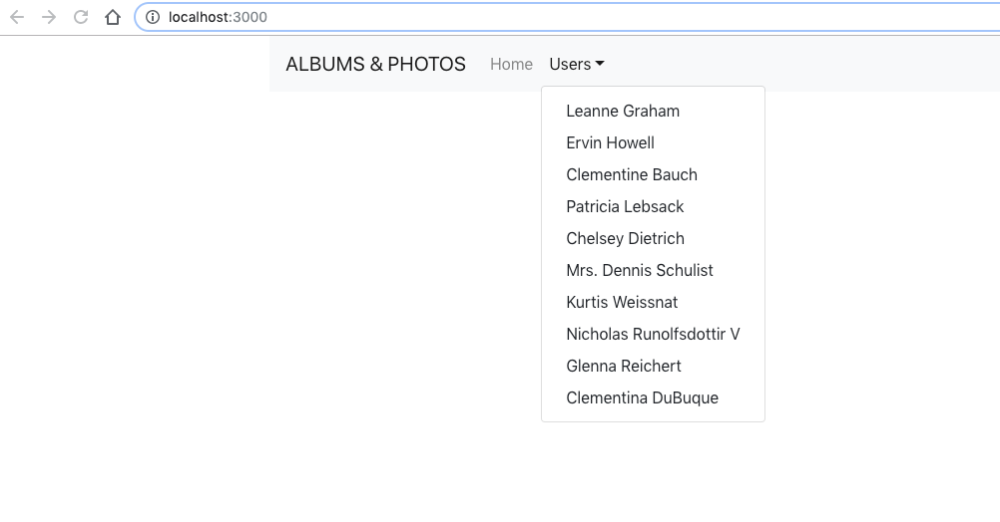
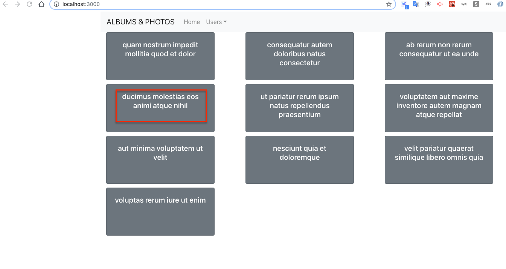
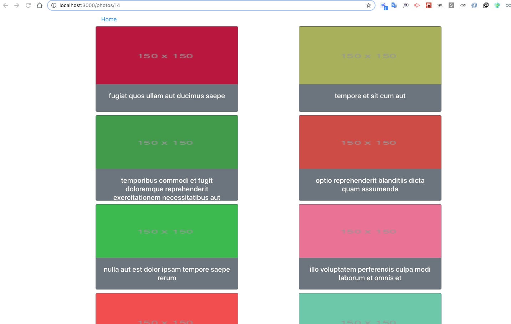
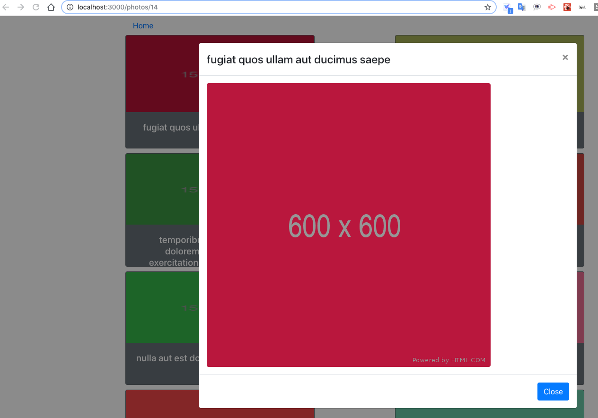
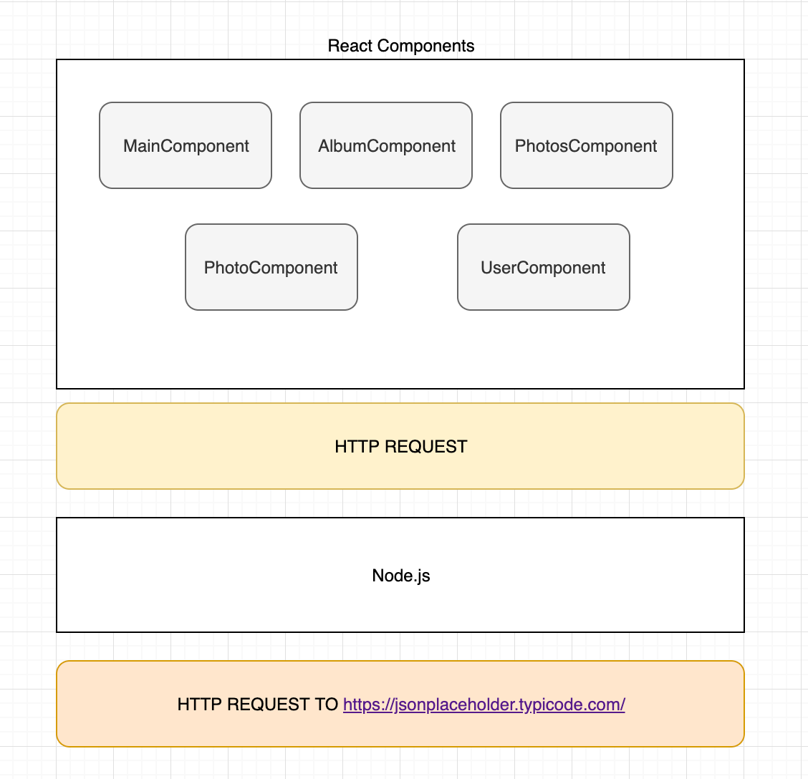
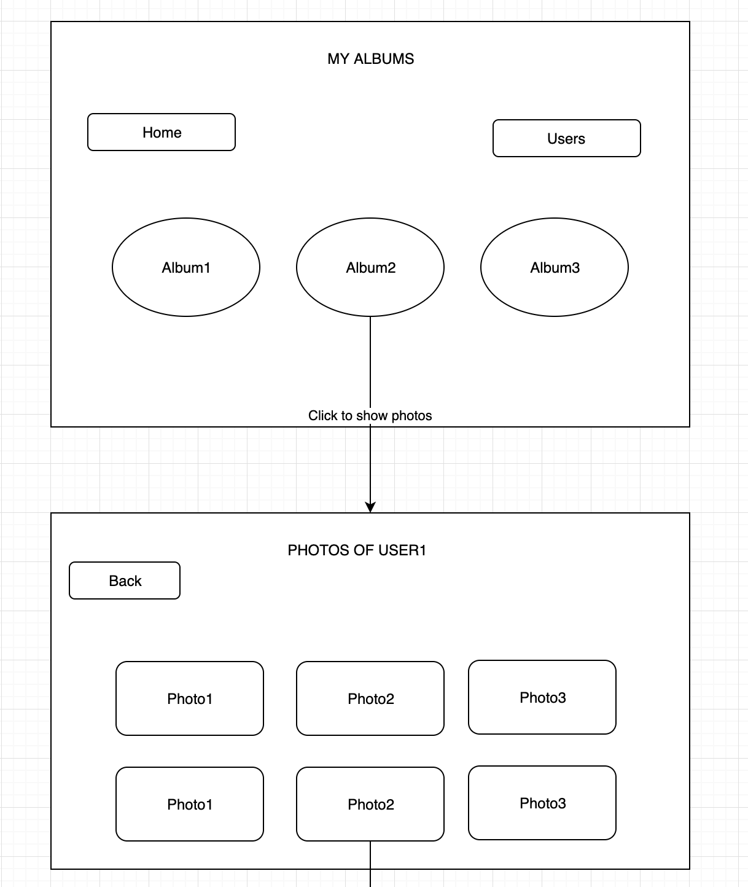
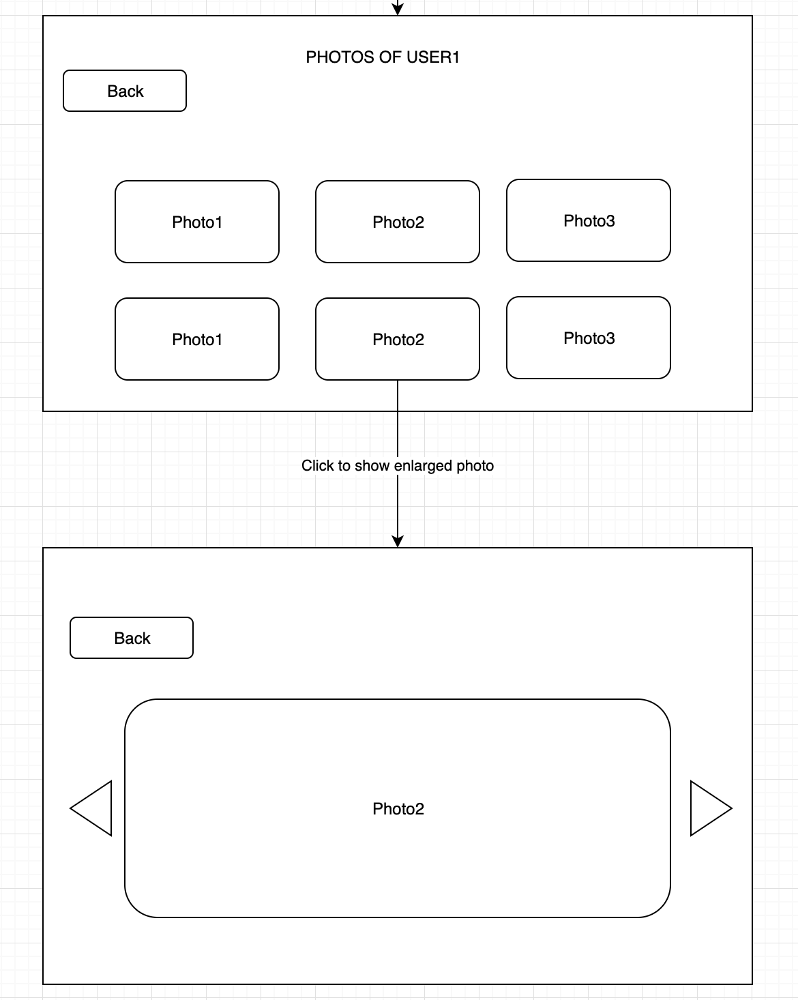

# Show Albums and Photos from https://jsonplaceholder.typicode.com/

# Run steps

-   git clone https://github.com/maplefu0601/albumPhotos.git
-   cd albumPhotos
-   cd client
-   npm install
-   cd ../server
-   npm install
-   cd ..
-   npm run start

You should see the main page.

Select any user from the dropdown list, then it will show all albums under that user.

Then select one of the albums, it will show all photos within that album.

Click any photo, it will show the original size image.

# Design and Wireframe

-   UI Wireframes
    
    

*   The wireframes are not exactly same as implementation.
